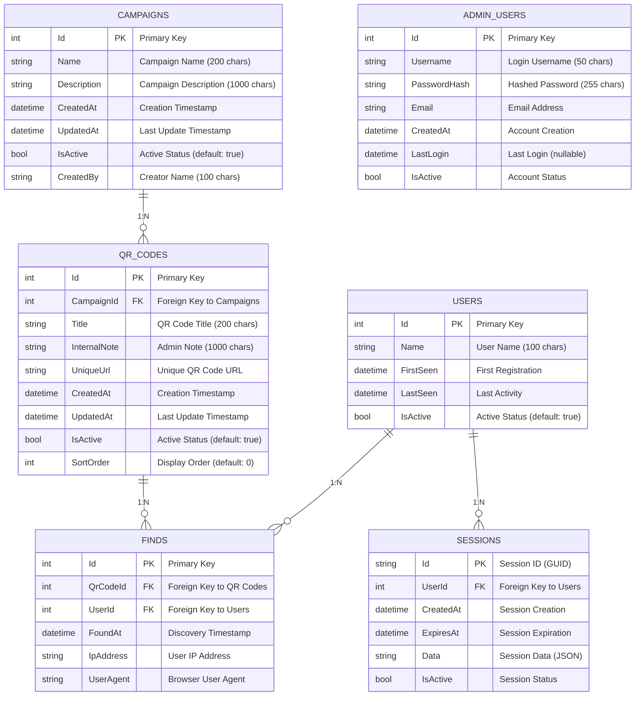

# 🏗️ System Architecture - Easter Egg Hunt System

## 📋 Architektur-Übersicht

Das Easter Egg Hunt System folgt **Clean Architecture** Prinzipien mit klarer Trennung der Verantwortlichkeiten und hoher Testbarkeit.

### Technologie-Stack

```
┌─────────────────────────────────────────────────────────────┐
│                    PRESENTATION LAYER                       │
├─────────────────────────────────────────────────────────────┤
│  Admin Web (MVC)     │  Employee Web (MVC)  │  Web API      │
│  - Razor Pages       │  - Mobile First      │  - REST API   │
│  - Bootstrap 5       │  - Progressive Web   │  - Swagger    │
│  - jQuery            │  - Service Worker    │  - JWT Auth   │
└─────────────────────────────────────────────────────────────┘
                                │
┌─────────────────────────────────────────────────────────────┐
│                    APPLICATION LAYER                        │
├─────────────────────────────────────────────────────────────┤
│  Services            │  DTOs               │  Validators    │
│  - CampaignService   │  - CampaignDto      │  - FluentVal.  │
│  - QrCodeService     │  - QrCodeDto        │  - Custom Val. │
│  - UserService       │  - UserDto          │  - Bus. Rules  │
└─────────────────────────────────────────────────────────────┘
                                │
┌─────────────────────────────────────────────────────────────┐
│                     DOMAIN LAYER                            │
├─────────────────────────────────────────────────────────────┤
│  Entities            │  Value Objects      │  Domain Events │
│  - Campaign          │  - QrCodeUrl        │  - QrCodeFound │
│  - QrCode            │  - SessionId        │  - CampaignEnd │
│  - User              │  - FindTimestamp    │  - UserJoined  │
│  - Find              │                     │                │
└─────────────────────────────────────────────────────────────┘
                                │
┌─────────────────────────────────────────────────────────────┐
│                  INFRASTRUCTURE LAYER                       │
├─────────────────────────────────────────────────────────────┤
│  Data Access         │  External Services  │  Cross-Cutting │
│  - EF Core           │  - QR Code Gen.     │  - Logging     │
│  - SQLite            │  - Email Service    │  - Caching     │
│  - Repository        │  - File Storage     │  - Monitoring  │
└─────────────────────────────────────────────────────────────┘
```

## 🏛️ Clean Architecture Layers

### 1. Domain Layer (Core)
**Verantwortlichkeit:** Business Logic und Domain Rules

```csharp
// Domain Entities
public class Campaign
{
    public int Id { get; private set; }
    public string Name { get; private set; }
    public string Description { get; private set; }
    public DateTime CreatedAt { get; private set; }
    public bool IsActive { get; private set; }
    
    private readonly List<QrCode> _qrCodes = new();
    public IReadOnlyList<QrCode> QrCodes => _qrCodes.AsReadOnly();
    
    // Domain Logic
    public void AddQrCode(string title, string note)
    {
        if (!IsActive)
            throw new DomainException("Kann keine QR-Codes zu inaktiver Kampagne hinzufügen");
            
        var qrCode = new QrCode(title, note, Id);
        _qrCodes.Add(qrCode);
        
        // Domain Event
        DomainEvents.Raise(new QrCodeAddedEvent(this, qrCode));
    }
}
```

### 2. Application Layer
**Verantwortlichkeit:** Use Cases und Application Services

```csharp
public class CampaignService : ICampaignService
{
    private readonly ICampaignRepository _repository;
    private readonly ICampaignValidator _validator;
    private readonly ILogger<CampaignService> _logger;
    
    public async Task<CampaignDto> CreateCampaignAsync(CreateCampaignRequest request)
    {
        // Validierung
        await _validator.ValidateAndThrowAsync(request);
        
        // Domain Logic
        var campaign = new Campaign(request.Name, request.Description);
        
        // Persistierung
        var savedCampaign = await _repository.SaveAsync(campaign);
        
        // Logging
        _logger.LogInformation("Kampagne {CampaignName} erstellt mit ID {CampaignId}", 
            campaign.Name, campaign.Id);
        
        return _mapper.Map<CampaignDto>(savedCampaign);
    }
}
```

### 3. Infrastructure Layer
**Verantwortlichkeit:** Data Access und externe Services

```csharp
public class CampaignRepository : ICampaignRepository
{
    private readonly EasterEggHuntDbContext _context;
    
    public async Task<Campaign> GetByIdAsync(int id)
    {
        return await _context.Campaigns
            .Include(c => c.QrCodes)
            .FirstOrDefaultAsync(c => c.Id == id);
    }
    
    public async Task<Campaign> SaveAsync(Campaign campaign)
    {
        _context.Campaigns.Add(campaign);
        await _context.SaveChangesAsync();
        return campaign;
    }
}
```

### 4. Presentation Layer
**Verantwortlichkeit:** UI und API Endpoints

```csharp
[ApiController]
[Route("api/[controller]")]
public class CampaignsController : ControllerBase
{
    private readonly ICampaignService _campaignService;
    
    /// <summary>
    /// Erstellt eine neue Kampagne
    /// </summary>
    [HttpPost]
    public async Task<ActionResult<CampaignDto>> CreateCampaign(
        [FromBody] CreateCampaignRequest request)
    {
        var campaign = await _campaignService.CreateCampaignAsync(request);
        return CreatedAtAction(nameof(GetCampaign), new { id = campaign.Id }, campaign);
    }
}
```

## 🗄️ Datenbank-Schema

### Entity Relationship Diagram



### Datenbank-Indizes

```sql
-- Performance-Indizes für häufige Abfragen
CREATE INDEX IX_Campaigns_IsActive ON Campaigns(IsActive);
CREATE INDEX IX_Campaigns_CreatedAt ON Campaigns(CreatedAt);
CREATE INDEX IX_Campaigns_Name ON Campaigns(Name);

CREATE INDEX IX_QrCodes_CampaignId ON QrCodes(CampaignId);
CREATE INDEX IX_QrCodes_IsActive ON QrCodes(IsActive);
CREATE INDEX IX_QrCodes_SortOrder ON QrCodes(SortOrder);
CREATE UNIQUE INDEX IX_QrCodes_UniqueUrl ON QrCodes(UniqueUrl);

CREATE INDEX IX_Users_IsActive ON Users(IsActive);
CREATE INDEX IX_Users_FirstSeen ON Users(FirstSeen);
CREATE INDEX IX_Users_LastSeen ON Users(LastSeen);
CREATE INDEX IX_Users_Name ON Users(Name);

CREATE INDEX IX_Finds_QrCodeId ON Finds(QrCodeId);
CREATE INDEX IX_Finds_UserId ON Finds(UserId);
CREATE INDEX IX_Finds_FoundAt ON Finds(FoundAt);
CREATE INDEX IX_Finds_QrCodeId_UserId ON Finds(QrCodeId, UserId);

CREATE INDEX IX_Sessions_UserId ON Sessions(UserId);
CREATE INDEX IX_Sessions_CreatedAt ON Sessions(CreatedAt);
CREATE INDEX IX_Sessions_ExpiresAt ON Sessions(ExpiresAt);

CREATE UNIQUE INDEX IX_AdminUsers_Username ON AdminUsers(Username);
CREATE INDEX IX_AdminUsers_CreatedAt ON AdminUsers(CreatedAt);
```

### EF Core Entities

```csharp
// Campaign Entity
public class Campaign
{
    public int Id { get; set; }
    public string Name { get; set; } = string.Empty;
    public string Description { get; set; } = string.Empty;
    public DateTime CreatedAt { get; set; }
    public DateTime UpdatedAt { get; set; }
    public bool IsActive { get; set; }
    public string CreatedBy { get; set; } = string.Empty;
    
    // Navigation Properties
    public virtual ICollection<QrCode> QrCodes { get; set; } = new List<QrCode>();
}

// QrCode Entity
public class QrCode
{
    public int Id { get; set; }
    public int CampaignId { get; set; }
    public string Title { get; set; } = string.Empty;
    public string InternalNote { get; set; } = string.Empty;
    public string UniqueUrl { get; set; } = string.Empty;
    public DateTime CreatedAt { get; set; }
    public DateTime UpdatedAt { get; set; }
    public bool IsActive { get; set; }
    public int SortOrder { get; set; }
    
    // Navigation Properties
    public virtual Campaign Campaign { get; set; } = null!;
    public virtual ICollection<Find> Finds { get; set; } = new List<Find>();
}

// User Entity
public class User
{
    public int Id { get; set; }
    public string Name { get; set; } = string.Empty;
    public DateTime FirstSeen { get; set; }
    public DateTime LastSeen { get; set; }
    public bool IsActive { get; set; }
    
    // Navigation Properties
    public virtual ICollection<Find> Finds { get; set; } = new List<Find>();
    public virtual ICollection<Session> Sessions { get; set; } = new List<Session>();
}

// Find Entity
public class Find
{
    public int Id { get; set; }
    public int QrCodeId { get; set; }
    public int UserId { get; set; }
    public DateTime FoundAt { get; set; }
    public string IpAddress { get; set; } = string.Empty;
    public string UserAgent { get; set; } = string.Empty;
    
    // Navigation Properties
    public virtual QrCode QrCode { get; set; } = null!;
    public virtual User User { get; set; } = null!;
}
```

## 🐳 Docker Architecture

### Docker Compose Setup

```yaml

services:
  # Web API Backend
  easteregghunt-api:
    build:
      context: .
      dockerfile: src/EasterEggHunt.Api/Dockerfile
    ports:
      - "5001:80"
    environment:
      - ASPNETCORE_ENVIRONMENT=Development
      - ConnectionStrings__DefaultConnection=Data Source=/app/data/easteregghunt.db
    volumes:
      - sqlite-data:/app/data
    depends_on:
      - sqlite-init
    networks:
      - easteregghunt-network

  # Web Frontend
  easteregghunt-web:
    build:
      context: .
      dockerfile: src/EasterEggHunt.Web/Dockerfile
    ports:
      - "5000:80"
    environment:
      - ASPNETCORE_ENVIRONMENT=Development
      - ApiSettings__BaseUrl=http://easteregghunt-api
    depends_on:
      - easteregghunt-api
    networks:
      - easteregghunt-network

  # SQLite Initialization
  sqlite-init:
    image: alpine:latest
    volumes:
      - sqlite-data:/data
    command: >
      sh -c "
        if [ ! -f /data/easteregghunt.db ]; then
          touch /data/easteregghunt.db
          chmod 666 /data/easteregghunt.db
        fi
      "

  # Nginx Reverse Proxy (Production)
  nginx:
    image: nginx:alpine
    ports:
      - "80:80"
      - "443:443"
    volumes:
      - ./nginx.conf:/etc/nginx/nginx.conf
      - ./ssl:/etc/nginx/ssl
    depends_on:
      - easteregghunt-web
      - easteregghunt-api
    networks:
      - easteregghunt-network

volumes:
  sqlite-data:

networks:
  easteregghunt-network:
    driver: bridge
```

## 🔧 Dependency Injection

### Service Registration

```csharp
// Program.cs
var builder = WebApplication.CreateBuilder(args);

// Database
builder.Services.AddDbContext<EasterEggHuntDbContext>(options =>
    options.UseSqlite(builder.Configuration.GetConnectionString("DefaultConnection")));

// Repositories
builder.Services.AddScoped<ICampaignRepository, CampaignRepository>();
builder.Services.AddScoped<IQrCodeRepository, QrCodeRepository>();
builder.Services.AddScoped<IUserRepository, UserRepository>();
builder.Services.AddScoped<IFindRepository, FindRepository>();

// Services
builder.Services.AddScoped<ICampaignService, CampaignService>();
builder.Services.AddScoped<IQrCodeService, QrCodeService>();
builder.Services.AddScoped<IUserService, UserService>();
builder.Services.AddScoped<IStatisticsService, StatisticsService>();

// Validators
builder.Services.AddScoped<ICampaignValidator, CampaignValidator>();
builder.Services.AddScoped<IQrCodeValidator, QrCodeValidator>();

// External Services
builder.Services.AddScoped<IQrCodeGenerator, QrCodeGenerator>();
builder.Services.AddScoped<IEmailService, EmailService>();

// Cross-Cutting Concerns
builder.Services.AddScoped<ICurrentUserService, CurrentUserService>();
builder.Services.AddScoped<IDateTimeProvider, DateTimeProvider>();

// AutoMapper
builder.Services.AddAutoMapper(typeof(MappingProfile));

// FluentValidation
builder.Services.AddFluentValidationAutoValidation();
builder.Services.AddValidatorsFromAssemblyContaining<CreateCampaignRequestValidator>();
```

## 🧪 Testing Architecture

### Test Pyramid

```
                    ┌─────────────────┐
                    │   E2E Tests     │ ← Wenige, kritische User Journeys
                    │   (Selenium)    │
                    └─────────────────┘
                  ┌───────────────────────┐
                  │  Integration Tests    │ ← API, Database, Services
                  │  (WebApplicationFactory) │
                  └───────────────────────┘
              ┌─────────────────────────────────┐
              │        Unit Tests               │ ← Viele, schnelle Tests
              │  (Domain, Services, Controllers) │
              └─────────────────────────────────┘
```

### Test-Struktur

```
tests/
├── EasterEggHunt.UnitTests/
│   ├── Domain/
│   │   ├── CampaignTests.cs
│   │   └── QrCodeTests.cs
│   ├── Application/
│   │   ├── CampaignServiceTests.cs
│   │   └── QrCodeServiceTests.cs
│   └── Presentation/
│       ├── CampaignsControllerTests.cs
│       └── QrCodesControllerTests.cs
├── EasterEggHunt.IntegrationTests/
│   ├── Api/
│   │   ├── CampaignsApiTests.cs
│   │   └── QrCodesApiTests.cs
│   ├── Database/
│   │   ├── CampaignRepositoryTests.cs
│   │   └── QrCodeRepositoryTests.cs
│   └── Services/
│       └── EmailServiceTests.cs
└── EasterEggHunt.E2ETests/
    ├── AdminWorkflowTests.cs
    ├── EmployeeWorkflowTests.cs
    └── QrCodeScanningTests.cs
```

## 🔒 Security Architecture

### Authentication & Authorization

```csharp
// Admin Authentication
services.AddAuthentication(CookieAuthenticationDefaults.AuthenticationScheme)
    .AddCookie(options =>
    {
        options.LoginPath = "/Admin/Login";
        options.LogoutPath = "/Admin/Logout";
        options.ExpireTimeSpan = TimeSpan.FromHours(8);
        options.SlidingExpiration = true;
    });

// Employee Session Management
services.AddSession(options =>
{
    options.IdleTimeout = TimeSpan.FromDays(30);
    options.Cookie.HttpOnly = true;
    options.Cookie.IsEssential = true;
    options.Cookie.SameSite = SameSiteMode.Strict;
});
```

### Security Headers

```csharp
app.Use(async (context, next) =>
{
    context.Response.Headers.Add("X-Content-Type-Options", "nosniff");
    context.Response.Headers.Add("X-Frame-Options", "DENY");
    context.Response.Headers.Add("X-XSS-Protection", "1; mode=block");
    context.Response.Headers.Add("Referrer-Policy", "strict-origin-when-cross-origin");
    
    if (context.Request.IsHttps)
    {
        context.Response.Headers.Add("Strict-Transport-Security", 
            "max-age=31536000; includeSubDomains");
    }
    
    await next();
});
```

## 📊 Performance Considerations

### Database Optimizations

```csharp
// Efficient Queries
public async Task<List<CampaignStatisticsDto>> GetCampaignStatisticsAsync()
{
    return await _context.Campaigns
        .Where(c => c.IsActive)
        .Select(c => new CampaignStatisticsDto
        {
            Id = c.Id,
            Name = c.Name,
            QrCodeCount = c.QrCodes.Count(),
            FindCount = c.QrCodes.SelectMany(q => q.Finds).Count(),
            ParticipantCount = c.QrCodes
                .SelectMany(q => q.Finds)
                .Select(f => f.UserId)
                .Distinct()
                .Count()
        })
        .ToListAsync();
}
```

### Caching Strategy

```csharp
// Memory Caching für häufig abgerufene Daten
services.AddMemoryCache();
services.AddScoped<ICachedCampaignService, CachedCampaignService>();

public class CachedCampaignService : ICampaignService
{
    private readonly ICampaignService _campaignService;
    private readonly IMemoryCache _cache;
    
    public async Task<List<CampaignDto>> GetActiveCampaignsAsync()
    {
        const string cacheKey = "active-campaigns";
        
        if (_cache.TryGetValue(cacheKey, out List<CampaignDto> campaigns))
        {
            return campaigns;
        }
        
        campaigns = await _campaignService.GetActiveCampaignsAsync();
        
        _cache.Set(cacheKey, campaigns, TimeSpan.FromMinutes(5));
        
        return campaigns;
    }
}
```

## 🚀 Deployment Architecture

### Production Environment

```
┌─────────────────────────────────────────────────────────────┐
│                    LOAD BALANCER                            │
│                   (Nginx/Traefik)                          │
└─────────────────────────────────────────────────────────────┘
                                │
        ┌───────────────────────┼───────────────────────┐
        │                       │                       │
┌───────▼──────┐    ┌──────────▼───────┐    ┌─────────▼──────┐
│  Web App 1   │    │   Web App 2     │    │   API Server   │
│  (Container) │    │   (Container)    │    │   (Container)  │
└──────────────┘    └──────────────────┘    └────────────────┘
                                │
                    ┌───────────▼────────────┐
                    │     SQLite Database    │
                    │    (Shared Volume)     │
                    └────────────────────────┘
```

### Monitoring & Logging

```csharp
// Structured Logging
services.AddLogging(builder =>
{
    builder.AddConsole();
    builder.AddFile("logs/easteregghunt-{Date}.log");
});

// Health Checks
services.AddHealthChecks()
    .AddDbContextCheck<EasterEggHuntDbContext>()
    .AddCheck<QrCodeServiceHealthCheck>("qrcode-service");

// Application Insights (optional)
services.AddApplicationInsightsTelemetry();
```

---

**Diese Architektur gewährleistet Skalierbarkeit, Wartbarkeit und hohe Testabdeckung gemäß Clean Code Prinzipien.**
