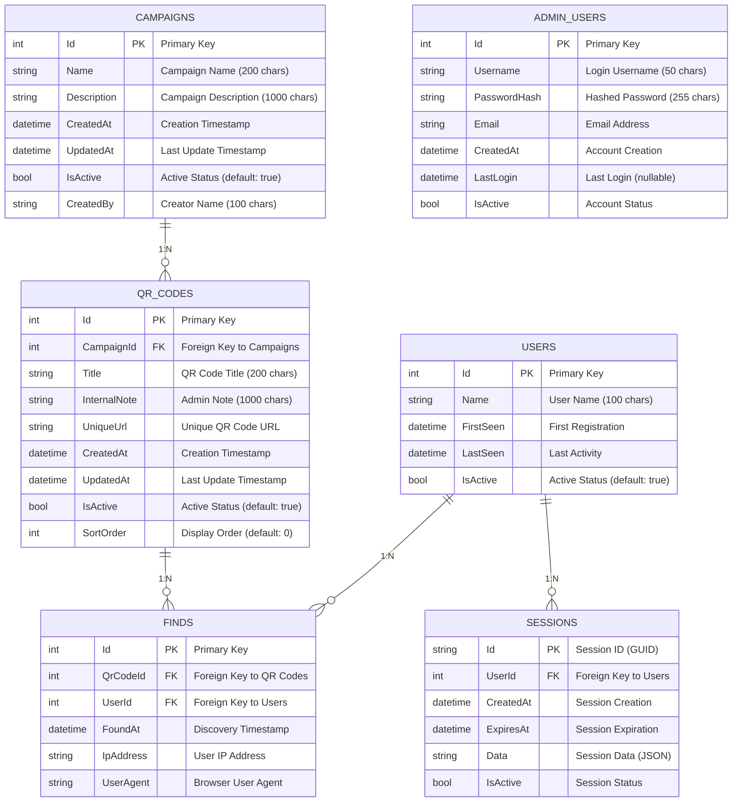

# 🗄️ Database Schema - Easter Egg Hunt System

## 📊 Entity Relationship Diagram

Das folgende Mermaid-Diagramm zeigt die Beziehungen zwischen allen Entitäten im System:



## 📋 Tabellen-Details

### 1. Campaigns (Kampagnen)
**Zweck:** Verwaltung von Easter Egg Hunt Kampagnen

| Spalte | Typ | Beschreibung | Constraints |
|--------|-----|--------------|------------|
| Id | INTEGER | Primärschlüssel | PRIMARY KEY, AUTOINCREMENT |
| Name | TEXT(200) | Name der Kampagne | NOT NULL |
| Description | TEXT(1000) | Beschreibung der Kampagne | NOT NULL |
| CreatedAt | TEXT | Erstellungszeitpunkt | NOT NULL |
| UpdatedAt | TEXT | Letzte Aktualisierung | NOT NULL |
| IsActive | INTEGER | Aktiv-Status | NOT NULL, DEFAULT 1 |
| CreatedBy | TEXT(100) | Ersteller der Kampagne | NOT NULL |

**Beziehungen:**
- `1:N` zu QR_CODES (eine Kampagne hat viele QR-Codes)

### 2. QrCodes (QR-Codes)
**Zweck:** Verwaltung der einzelnen QR-Codes innerhalb einer Kampagne

| Spalte | Typ | Beschreibung | Constraints |
|--------|-----|--------------|------------|
| Id | INTEGER | Primärschlüssel | PRIMARY KEY, AUTOINCREMENT |
| CampaignId | INTEGER | Fremdschlüssel zu Campaigns | NOT NULL, FK |
| Title | TEXT(200) | Öffentlicher Titel | NOT NULL |
| InternalNote | TEXT(1000) | Interne Notiz für Admins | NOT NULL |
| UniqueUrl | TEXT | Eindeutige URL für QR-Code | NOT NULL, UNIQUE |
| CreatedAt | TEXT | Erstellungszeitpunkt | NOT NULL |
| UpdatedAt | TEXT | Letzte Aktualisierung | NOT NULL |
| IsActive | INTEGER | Aktiv-Status | NOT NULL, DEFAULT 1 |
| SortOrder | INTEGER | Sortierreihenfolge | NOT NULL, DEFAULT 0 |

**Beziehungen:**
- `N:1` zu CAMPAIGNS (viele QR-Codes gehören zu einer Kampagne)
- `1:N` zu FINDS (ein QR-Code kann mehrfach gefunden werden)

### 3. Users (Benutzer)
**Zweck:** Verwaltung der Mitarbeiter/Benutzer

| Spalte | Typ | Beschreibung | Constraints |
|--------|-----|--------------|------------|
| Id | INTEGER | Primärschlüssel | PRIMARY KEY, AUTOINCREMENT |
| Name | TEXT(100) | Name des Benutzers | NOT NULL |
| FirstSeen | TEXT | Erste Registrierung | NOT NULL |
| LastSeen | TEXT | Letzte Aktivität | NOT NULL |
| IsActive | INTEGER | Aktiv-Status | NOT NULL, DEFAULT 1 |

**Beziehungen:**
- `1:N` zu FINDS (ein Benutzer kann viele QR-Codes finden)
- `1:N` zu SESSIONS (ein Benutzer kann mehrere Sessions haben)

### 4. Finds (Funde)
**Zweck:** Protokollierung der QR-Code Funde

| Spalte | Typ | Beschreibung | Constraints |
|--------|-----|--------------|------------|
| Id | INTEGER | Primärschlüssel | PRIMARY KEY, AUTOINCREMENT |
| QrCodeId | INTEGER | Fremdschlüssel zu QrCodes | NOT NULL, FK |
| UserId | INTEGER | Fremdschlüssel zu Users | NOT NULL, FK |
| FoundAt | TEXT | Zeitpunkt des Fundes | NOT NULL |
| IpAddress | TEXT | IP-Adresse des Benutzers | NOT NULL |
| UserAgent | TEXT | Browser User-Agent | NOT NULL |

**Beziehungen:**
- `N:1` zu QR_CODES (viele Funde gehören zu einem QR-Code)
- `N:1` zu USERS (viele Funde gehören zu einem Benutzer)

### 5. Sessions (Sessions)
**Zweck:** Verwaltung der Benutzer-Sessions

| Spalte | Typ | Beschreibung | Constraints |
|--------|-----|--------------|------------|
| Id | TEXT | Session-ID (GUID) | PRIMARY KEY |
| UserId | INTEGER | Fremdschlüssel zu Users | NOT NULL, FK |
| CreatedAt | TEXT | Session-Erstellung | NOT NULL |
| ExpiresAt | TEXT | Session-Ablauf | NOT NULL |
| Data | TEXT | Session-Daten (JSON) | NOT NULL |
| IsActive | INTEGER | Session-Status | NOT NULL |

**Beziehungen:**
- `N:1` zu USERS (viele Sessions gehören zu einem Benutzer)

### 6. AdminUsers (Administratoren)
**Zweck:** Verwaltung der Administrator-Benutzer

| Spalte | Typ | Beschreibung | Constraints |
|--------|-----|--------------|------------|
| Id | INTEGER | Primärschlüssel | PRIMARY KEY, AUTOINCREMENT |
| Username | TEXT(50) | Login-Benutzername | NOT NULL, UNIQUE |
| PasswordHash | TEXT(255) | Gehashtes Passwort | NOT NULL |
| Email | TEXT | E-Mail-Adresse | NOT NULL |
| CreatedAt | TEXT | Account-Erstellung | NOT NULL |
| LastLogin | TEXT | Letzter Login | NULL |
| IsActive | INTEGER | Account-Status | NOT NULL |

## 🔍 Datenbank-Indizes

### Performance-Indizes für häufige Abfragen

```sql
-- Campaigns-Indizes
CREATE INDEX IX_Campaigns_IsActive ON Campaigns(IsActive);
CREATE INDEX IX_Campaigns_CreatedAt ON Campaigns(CreatedAt);
CREATE INDEX IX_Campaigns_Name ON Campaigns(Name);

-- QrCodes-Indizes
CREATE INDEX IX_QrCodes_CampaignId ON QrCodes(CampaignId);
CREATE INDEX IX_QrCodes_IsActive ON QrCodes(IsActive);
CREATE INDEX IX_QrCodes_SortOrder ON QrCodes(SortOrder);
CREATE UNIQUE INDEX IX_QrCodes_UniqueUrl ON QrCodes(UniqueUrl);

-- Users-Indizes
CREATE INDEX IX_Users_IsActive ON Users(IsActive);
CREATE INDEX IX_Users_FirstSeen ON Users(FirstSeen);
CREATE INDEX IX_Users_LastSeen ON Users(LastSeen);
CREATE INDEX IX_Users_Name ON Users(Name);

-- Finds-Indizes
CREATE INDEX IX_Finds_QrCodeId ON Finds(QrCodeId);
CREATE INDEX IX_Finds_UserId ON Finds(UserId);
CREATE INDEX IX_Finds_FoundAt ON Finds(FoundAt);
CREATE INDEX IX_Finds_QrCodeId_UserId ON Finds(QrCodeId, UserId);

-- Sessions-Indizes
CREATE INDEX IX_Sessions_UserId ON Sessions(UserId);
CREATE INDEX IX_Sessions_CreatedAt ON Sessions(CreatedAt);
CREATE INDEX IX_Sessions_ExpiresAt ON Sessions(ExpiresAt);

-- AdminUsers-Indizes
CREATE UNIQUE INDEX IX_AdminUsers_Username ON AdminUsers(Username);
CREATE INDEX IX_AdminUsers_CreatedAt ON AdminUsers(CreatedAt);
```

## 🔄 Geschäftslogik-Regeln

### Campaigns
- Eine Kampagne kann nur aktiviert werden, wenn sie mindestens einen QR-Code hat
- Beim Deaktivieren einer Kampagne werden alle zugehörigen QR-Codes ebenfalls deaktiviert
- Kampagnen-Namen müssen eindeutig sein

### QrCodes
- QR-Codes können nur zu aktiven Kampagnen hinzugefügt werden
- Jeder QR-Code hat eine eindeutige URL
- QR-Codes können mehrfach gefunden werden (bleiben liegen)

### Users
- Benutzer werden automatisch erstellt beim ersten QR-Code-Scan
- Benutzer-Namen müssen nicht eindeutig sein (mehrere Personen können denselben Namen haben)
- Inaktive Benutzer können keine neuen QR-Codes finden

### Finds
- Jeder Fund wird protokolliert mit Zeitstempel, IP und User-Agent
- Ein Benutzer kann denselben QR-Code mehrfach finden
- Funde können nicht gelöscht werden (Audit-Trail)

### Sessions
- Sessions haben eine Standard-Gültigkeitsdauer von 30 Tagen
- Abgelaufene Sessions werden automatisch als inaktiv markiert
- Session-Daten werden als JSON gespeichert

### AdminUsers
- Admin-Benutzernamen müssen eindeutig sein
- Passwörter werden gehasht gespeichert
- Inaktive Admins können sich nicht anmelden

## 📈 Performance-Überlegungen

### Häufige Abfragen
1. **Aktive Kampagnen abrufen** → Index auf `IsActive`
2. **QR-Codes einer Kampagne** → Index auf `CampaignId`
3. **Funde eines Benutzers** → Index auf `UserId`
4. **Funde eines QR-Codes** → Index auf `QrCodeId`
5. **Session-Validierung** → Index auf `UserId` und `ExpiresAt`

### Datenvolumen-Schätzungen
- **Kampagnen:** 10-50 pro Jahr
- **QR-Codes:** 20-200 pro Kampagne
- **Benutzer:** 50-500 pro Kampagne
- **Funde:** 100-2000 pro Kampagne
- **Sessions:** 50-500 aktive Sessions

### Optimierungen
- Regelmäßige Bereinigung abgelaufener Sessions
- Archivierung alter Kampagnen nach 2 Jahren
- Komprimierung von Session-Daten bei Bedarf

---

**Dieses Schema unterstützt alle Anforderungen des Easter Egg Hunt Systems und ist für Skalierung und Performance optimiert.**
