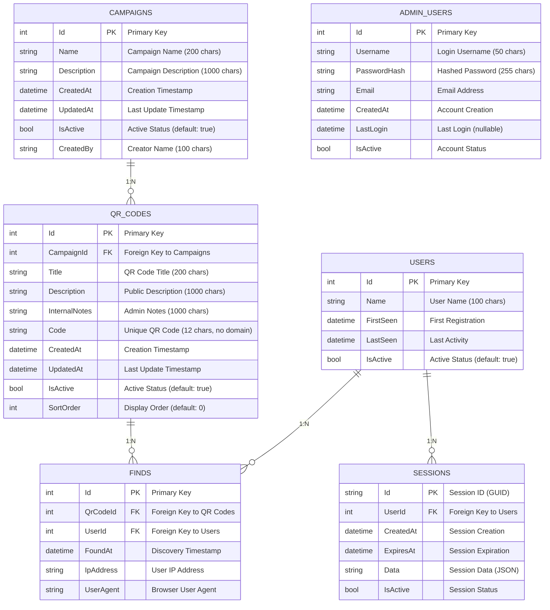

# 🏗️ System Architecture - Easter Egg Hunt System

## 📋 Architektur-Übersicht

Das Easter Egg Hunt System folgt **Clean Architecture** Prinzipien mit klarer Trennung der Verantwortlichkeiten und hoher Testbarkeit.

### Technologie-Stack

```
┌─────────────────────────────────────────────────────────────┐
│                    PRESENTATION LAYER                       │
├─────────────────────────────────────────────────────────────┤
│  Admin Web (MVC)     │  Employee Web (MVC)  │  Web API      │
│  - Razor Pages       │  - Mobile First      │  - REST API   │
│  - Bootstrap 5       │  - Progressive Web   │  - Swagger    │
│  - jQuery            │  - Service Worker    │  - JWT Auth   │
└─────────────────────────────────────────────────────────────┘
                                │
┌─────────────────────────────────────────────────────────────┐
│                    APPLICATION LAYER                        │
├─────────────────────────────────────────────────────────────┤
│  Services            │  DTOs               │  Validators    │
│  - CampaignService   │  - CampaignDto      │  - FluentVal.  │
│  - QrCodeService     │  - QrCodeDto        │  - Custom Val. │
│  - UserService       │  - UserDto          │  - Bus. Rules  │
└─────────────────────────────────────────────────────────────┘
                                │
┌─────────────────────────────────────────────────────────────┐
│                     DOMAIN LAYER                            │
├─────────────────────────────────────────────────────────────┤
│  Entities            │  Value Objects      │  Domain Events │
│  - Campaign          │  - QrCode           │  - QrCodeFound │
│  - QrCode            │  - SessionId        │  - CampaignEnd │
│  - User              │  - FindTimestamp    │  - UserJoined  │
│  - Find              │                     │                │
└─────────────────────────────────────────────────────────────┘
                                │
┌─────────────────────────────────────────────────────────────┐
│                  INFRASTRUCTURE LAYER                       │
├─────────────────────────────────────────────────────────────┤
│  Data Access         │  External Services  │  Cross-Cutting │
│  - EF Core           │  - QR Code Gen.     │  - Logging     │
│  - SQLite            │  - Email Service    │  - Caching     │
│  - Repository        │  - File Storage     │  - Monitoring  │
└─────────────────────────────────────────────────────────────┘
```

## 🏛️ Clean Architecture Layers

### 1. Domain Layer (Core)
**Verantwortlichkeit:** Business Logic und Domain Rules

- **Entities**: Campaign, QrCode, User, Find, Session, AdminUser
- **Value Objects**: QrCodeUrl, SessionId, FindTimestamp
- **Domain Events**: QrCodeFound, CampaignEnd, UserJoined
- **Repository Interfaces**: ICampaignRepository, IQrCodeRepository, etc.

### 2. Application Layer
**Verantwortlichkeit:** Use Cases und Application Services

- **Services**: CampaignService, QrCodeService, UserService, StatisticsService
- **DTOs**: CampaignDto, QrCodeDto, UserDto, FindDto
- **Validators**: FluentValidation für alle Eingaben
- **Mappers**: AutoMapper für Entity-DTO Konvertierung

### 3. Infrastructure Layer
**Verantwortlichkeit:** Data Access und externe Services

- **Repositories**: Implementierung aller Repository-Interfaces
- **DbContext**: EasterEggHuntDbContext mit EF Core
- **External Services**: QR-Code-Generator, E-Mail-Service
- **Configuration**: Dependency Injection Setup

### 4. Presentation Layer
**Verantwortlichkeit:** UI und API Endpoints

- **Web API**: RESTful Endpoints für Mobile/Web Clients
- **MVC Controllers**: Admin-Interface und Employee-Interface
- **Razor Pages**: Server-side gerenderte UI
- **Swagger**: API-Dokumentation

## 🗄️ Datenbank-Schema

### Entity Relationship Diagram



### Datenbank-Indizes

```sql
-- Performance-Indizes für häufige Abfragen
CREATE INDEX IX_Campaigns_IsActive ON Campaigns(IsActive);
CREATE INDEX IX_Campaigns_CreatedAt ON Campaigns(CreatedAt);
CREATE INDEX IX_Campaigns_Name ON Campaigns(Name);

CREATE INDEX IX_QrCodes_CampaignId ON QrCodes(CampaignId);
CREATE INDEX IX_QrCodes_IsActive ON QrCodes(IsActive);
CREATE INDEX IX_QrCodes_SortOrder ON QrCodes(SortOrder);
CREATE UNIQUE INDEX IX_QrCodes_Code ON QrCodes(Code);

CREATE INDEX IX_Users_IsActive ON Users(IsActive);
CREATE INDEX IX_Users_FirstSeen ON Users(FirstSeen);
CREATE INDEX IX_Users_LastSeen ON Users(LastSeen);
CREATE INDEX IX_Users_Name ON Users(Name);

CREATE INDEX IX_Finds_QrCodeId ON Finds(QrCodeId);
CREATE INDEX IX_Finds_UserId ON Finds(UserId);
CREATE INDEX IX_Finds_FoundAt ON Finds(FoundAt);
CREATE INDEX IX_Finds_QrCodeId_UserId ON Finds(QrCodeId, UserId);

CREATE INDEX IX_Sessions_UserId ON Sessions(UserId);
CREATE INDEX IX_Sessions_CreatedAt ON Sessions(CreatedAt);
CREATE INDEX IX_Sessions_ExpiresAt ON Sessions(ExpiresAt);

CREATE UNIQUE INDEX IX_AdminUsers_Username ON AdminUsers(Username);
CREATE INDEX IX_AdminUsers_CreatedAt ON AdminUsers(CreatedAt);
```

## 🐳 Docker Architecture

### Aktuelle Docker Compose Konfiguration

```yaml
services:
  # Web API Backend
  easteregghunt-api:
    image: easteregghunt/api:latest
    ports:
      - "5001:8080"
    environment:
      - ASPNETCORE_ENVIRONMENT=Development
      - ASPNETCORE_URLS=http://+:8080
      - ConnectionStrings__DefaultConnection=Data Source=/app/data/easteregghunt.db
    volumes:
      - sqlite-data:/app/data
    networks:
      - easteregghunt-network
    restart: unless-stopped

  # Web Frontend
  easteregghunt-web:
    image: easteregghunt/web:latest
    ports:
      - "5000:8080"
    environment:
      - ASPNETCORE_ENVIRONMENT=Development
      - ASPNETCORE_URLS=http://+:8080
      - ApiSettings__BaseUrl=http://easteregghunt-api:8080
    depends_on:
      - easteregghunt-api
    networks:
      - easteregghunt-network
    restart: unless-stopped

volumes:
  sqlite-data:
    driver: local

networks:
  easteregghunt-network:
    driver: bridge
```

### Build-System

- **Docker Buildx Bake**: Multi-Service Builds mit Caching
- **Multi-Platform Support**: linux/amd64, linux/arm64
- **Optimierte Dockerfiles**: Multi-Stage Builds für kleinere Images
- **Volume Management**: SQLite-Datenbank als persistentes Volume

## 🔧 Dependency Injection

### Service Registration

Die Dependency Injection wird in `ServiceCollectionExtensions.cs` konfiguriert:

- **Database**: `EasterEggHuntDbContext` mit SQLite
- **Repositories**: Alle Repository-Interfaces und -Implementierungen
- **Services**: Application Services für Business Logic
- **Validators**: FluentValidation für Input-Validierung
- **External Services**: QR-Code-Generator, E-Mail-Service
- **Cross-Cutting Concerns**: Logging, Caching, Monitoring

## 🧪 Testing Architecture

### Test Pyramid

```
                    ┌─────────────────┐
                    │   E2E Tests     │ ← Wenige, kritische User Journeys
                    │   (Selenium)    │
                    └─────────────────┘
                  ┌───────────────────────┐
                  │  Integration Tests    │ ← API, Database, Services
                  │  (WebApplicationFactory) │
                  └───────────────────────┘
              ┌─────────────────────────────────┐
              │        Unit Tests               │ ← Viele, schnelle Tests
              │  (Domain, Services, Controllers) │
              └─────────────────────────────────┘
```

### Test-Struktur

```
tests/
├── EasterEggHunt.Domain.Tests/          # Domain Entity Tests
├── EasterEggHunt.Application.Tests/     # Service Tests
├── EasterEggHunt.Infrastructure.Tests/  # Repository Integration Tests
└── EasterEggHunt.Api.Tests/             # API Controller Tests
```

### Aktuelle Test-Statistiken

- **~792 Tests** insgesamt
  - Domain Tests: 203 Tests (89.6% Coverage) ✅
  - Application Tests: 237 Tests (90.52% Coverage) ✅
  - Infrastructure Tests: 173 Tests (39.16% Coverage) ⚠️
  - API Tests: 80 Tests
  - Integration Tests: 37 Tests (E2E)
  - Web Tests: 62 Tests
- **Code Coverage** (Domain: 89.6%, Application: 90.52%, Infrastructure: 39.16%)
- **Test-Pyramide**: 73% Unit, 22% Integration, 5% E2E ✅
- **Test-Geschwindigkeit**: ~22s für alle Tests ✅
- **Integration Tests** mit echter SQLite-Datenbank
- **Unit Tests** für alle Domain Entities mit umfassenden Edge Cases

**Detaillierte Metriken:** Siehe [TEST_METRICS.md](./TEST_METRICS.md) und [TEST_STRATEGY.md](./TEST_STRATEGY.md)

### Integration Test Architecture

Das System verfügt über umfassende Integration Tests, die komplette User-Journeys testen:

- **Admin-Workflow Tests**: Kompletter Admin-Login → Dashboard → Kampagne erstellen Workflow
- **Employee-Journey Tests**: QR-Code scannen → Registrierung → Fund speichern
- **Campaign-Lifecycle Tests**: Kampagne erstellen → QR-Codes hinzufügen → Aktivieren
- **QR-Code Management Tests**: QR-Code CRUD + Statistiken + Drucklayout
- **Cross-Cutting Tests**: Sessions, Concurrency, Error-Handling

**Test-Pyramide:**
```
    🔺 E2E Workflow Tests (163 Tests)
   🔺🔺 Controller Integration Tests (9 Tests)  
  🔺🔺🔺 Repository Integration Tests (12 Tests)
```

#### WebApplicationFactory Architektur

Das System verwendet eine hierarchische WebApplicationFactory Architektur für saubere und wartbare Integration Tests:

**`TestWebApplicationFactoryBase`** - Basis-Klasse:
- **Zentralisierte Logging-Konfiguration** (`LogLevel.Critical`)
- **Basis-Test-Einstellungen** (SeedData=false, AutoMigrate=true, CORS)
- **Wiederverwendbare** Konfiguration für alle Test-Typen

**`ControllerTestWebApplicationFactory`** - Für Controller Tests:
- **Erbt** von `TestWebApplicationFactoryBase`
- **Eigene SQLite-Datenbank** pro Test
- **Automatische Datenbank-Bereinigung`
- **Verwendet** von `QrCodesControllerIntegrationTests`

**`TestWebApplicationFactory`** - Für Workflow Tests:
- **Erbt** von `TestWebApplicationFactoryBase`
- **Seed-Daten** für komplexe Workflow Tests
- **Verwendet** von allen Workflow Tests (CampaignLifecycle, EmployeeJourney, etc.)

**Vorteile:**
- **DRY-Prinzip** - keine Code-Duplikation mehr
- **Wartbarkeit** - Logging-Konfiguration zentral verwaltet
- **Saubere Tests** - Tests fokussieren sich auf Test-Logik, nicht auf Setup
- **Spezialisierung** - Spezifische Factories für verschiedene Test-Anforderungen

## 🔒 Security Architecture

### Authentication & Authorization

- **Admin Authentication**: Cookie-basierte Authentifizierung
- **Employee Sessions**: Cookie-basierte Session-Verwaltung
- **Password Hashing**: BCrypt für sichere Passwort-Speicherung
- **Session Management**: 30-Tage Standard-Gültigkeitsdauer

### Security Headers

- **X-Content-Type-Options**: nosniff
- **X-Frame-Options**: DENY
- **X-XSS-Protection**: 1; mode=block
- **Referrer-Policy**: strict-origin-when-cross-origin
- **Strict-Transport-Security**: HTTPS-Enforcement

## 📊 Performance Considerations

### Database Optimizations

- **Indizes** für alle häufigen Abfrage-Patterns
- **Composite Indizes** für komplexe Queries
- **Eager Loading** für Navigation Properties
- **Query Optimization** mit EF Core

### Caching Strategy

- **Memory Caching** für häufig abgerufene Daten
- **Session Caching** für Benutzer-Daten
- **Query Result Caching** für Statistiken

## 🚀 Deployment Architecture

### Development Environment

```
┌─────────────────────────────────────────────────────────────┐
│                    Docker Compose                          │
│  ┌─────────────────┐    ┌─────────────────┐                │
│  │  Web Frontend   │    │  Web API        │                │
│  │  (Port 5000)    │    │  (Port 5001)    │                │
│  └─────────────────┘    └─────────────────┘                │
│           │                       │                        │
│           └───────────┬───────────┘                        │
│                       │                                    │
│  ┌─────────────────────▼─────────────────────┐             │
│  │         SQLite Database                   │             │
│  │      (Persistent Volume)                  │             │
│  └───────────────────────────────────────────┘             │
└─────────────────────────────────────────────────────────────┘
```

### Production Considerations

- **Load Balancer**: Nginx oder Traefik
- **SSL/TLS**: HTTPS-Enforcement
- **Monitoring**: Application Insights oder ähnlich
- **Backup**: Regelmäßige SQLite-Backups
- **Scaling**: Horizontal mit Load Balancer

## 🔄 CI/CD Pipeline

### GitHub Actions

- **Build**: .NET 8.0 Build mit Code Analysis
- **Test**: Alle Tests mit Coverage-Reporting
- **Quality**: Code Coverage Minimum 80%
- **Security**: Dependency Scanning
- **Docker**: Multi-Platform Image Builds

### Quality Gates

- **Code Coverage**: Minimum 80% (Domain/Infrastructure)
- **Code Analysis**: Keine Warnings erlaubt
- **Security Scan**: Automatische Vulnerability-Checks
- **Format Check**: Einheitliche Code-Formatierung

---

**Diese Architektur gewährleistet Skalierbarkeit, Wartbarkeit und hohe Testabdeckung gemäß Clean Code Prinzipien.**